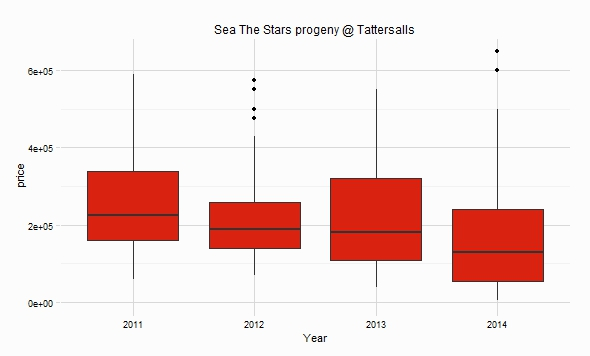

rBloodstock 1.0.0
=================

R package with variety of datasets from Thoroughbred Bloodstock Sales, at the time of writing there are 6 datasets of Tattersalls sales from 2010 to 2015 (incomplete)

#### Installation
Within R
```R
devtools::install_github(repo = "durtal/rBloodstock")
```

#### Datasets
Only Tattersalls sales are in the package at the moment, hopefully others will be added in time (sales from Goffs etc.)

##### Tattersalls sales
Data was sourced from [Tattersalls](http://db.tattersalls.com/4DCGI/Entry/Index)

Name | Sales included | Dim
-----|----------------|-----
tatts_2010 | <sub>dec_mares, dec_foals, dec_yearlings, autumn_hit, breeders_flat, oct_bk3, oct_bk2, oct_bk1, july, guineas, craven, feb</sub> | 7796 rows, 12 cols
tatts_2011 | <sub>dec_mares, dec_foals, dec_yearlings, autumn_hit, breeders_flat, oct_bk3, oct_bk2, oct_bk1, july, breeze_up, craven, feb</sub> | 6946 rows, 12 cols
tatts_2012 | <sub>dec_mares, dec_foals, dec_yearlings, autumn_hit, oct_bk3, oct_bk2, oct_bk1, july, guineas_hit, guineas, craven, feb</sub> | 7101 rows, 12 cols
tatts_2013 | <sub>dec_mares, dec_foals, dec_yearlings, autumn_hit, oct_bk4, oct_bk3, oct_bk2, oct_bk1, july, guineas_hit, guineas, craven, feb</sub> | 7192 rows, 12 cols
tatts_2014 | <sub>dec_mares, dec_foals, dec_yearlings, autumn_hit, oct_bk4, oct_bk3, oct_bk2, oct_bk1, july, guineas_hit, guineas, craven, feb</sub> | 7429 rows, 12 cols
tatts_2015 | <sub>guineas_hit, guineas, craven, feb</sub> | 733 rows, 12 cols

The `collect_tatts_sales` function will collect data from a sale that is perhaps not included in the package datasets.  The format Tattersalls presents data appears to be consistent across all sales, however no guarantees are made this function will perform as desired, if you discover an issue let me know.

##### Example

```
# load library
library(rBloodstock)
# load datasets, combine, and then remove individual datasets
data(tatts_2010, tatts_2011, tatts_2012, tatts_2013, tatts_2014, tatts_2015)
tattersalls <- rbind(tatts_2010, tatts_2011, tatts_2012, tatts_2013, tatts_2014, tatts_2015)
rm(tatts_2010, tatts_2011, tatts_2012, tatts_2013, tatts_2014, tatts_2015)

# load dplyr and ggplot
tattersalls %>%
    filter(grepl("sea the stars", sire)) %>%
    group_by(year) %>%
    ggplot(aes(x = factor(year), y = price)) +
        geom_boxplot(fill = "#d9220f") +
        RcappeR::theme_rcapper() + # my other package for a nice theme :-)
        labs(x = "Year", title = "Sea The Stars progeny @ Tattersalls")
```


